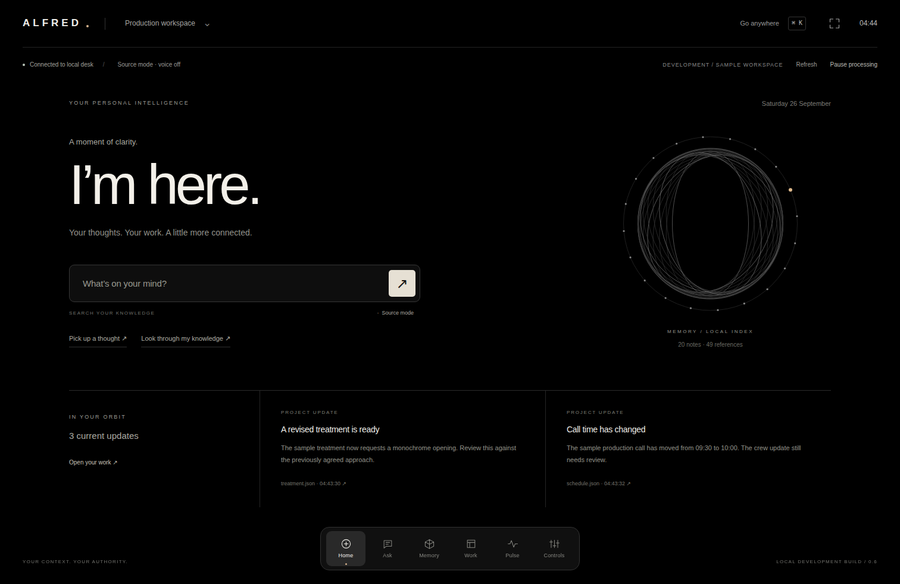

# ALFRED

Personal intelligence. Your context, your attention, your authority.

## Personal OS v0.6: local development build

The default interface is now a full-screen personal workspace, not the v0.5 administrative
dashboard. Home, Ask, Memory, Work, Pulse and Controls share a persistent dock and a
keyboard launcher. The existing core, evidence, approvals and source retrieval are retained.



**Working branch:** `feat/alfred-personal-os-2026-09-26`.
Built on grounded Desk `af10f961665962a42d2d78f00864edb9c267db26`. The pull-request stack is
not automatically merged and main is not the application. Nothing is hosted by this work.

[Run guide](docs/PERSONAL_OS.md) · [Roadmap](docs/ROADMAP.md) ·
[Continuation](SESSION_HANDOFF.md) · [Memory architecture](docs/MEMORY_ARCHITECTURE.md)

### What works

A local authenticated workspace with source-first questions, read-only Markdown and JSON
connectors, an explicit note-reference graph, source inspection and invalidation, evidence
export, exact draft approvals and local result verification. The supervisor scans while
the launched process is alive. New Pulse routines perform bounded memory-health and
briefing-count reports, with opt-in schedules and durable run records. Both start off.

Ctrl/Cmd+K navigates or searches sources. Focus changes presentation, not permissions.
The only action effect remains a draft inside ALFRED's database. Nothing is sent externally.

### Start locally

```sh
python3 -m alfred.desk init --data-dir ~/.local/share/alfred/os-v06-demo
python3 -m alfred.desk access --data-dir ~/.local/share/alfred/os-v06-demo
python3 -m alfred.desk serve --data-dir ~/.local/share/alfred/os-v06-demo
```

Open the local address printed by the command. Keep the access key private. Use synthetic
files while developing. The service binds to 127.0.0.1; it is not a public hosting server.

### Inspect and test

```sh
python3 -m unittest discover -s tests -v
python3 tools/import_sources.py --verify
python3 tools/extend_sources.py --verify
```

The two source verifiers need the full GitHub branch; the developer ZIP excludes upstream
archives. All 2,073 retained third-party files remain inert and unchanged. See the source
locks, licences and copy receipts, not just a count. No upstream agent has been executed.

The acceptance workflow records code tests, old browser regressions, new OS/Pulse browser
checks, standalone-preview checks and exact source hashes under
`docs/evidence/personal-os-v06/`. A workflow file is not a test result.

The [offline preview](docs/previews/personal-os-v06/ALFRED-OS-v06.html) is fictional,
read-only and not connected to a server or model. Run the actual local app for actions.

### Boundaries

This is a browser-based personal OS shell over local intelligence infrastructure, not a
native operating system. No real model inference has been validated, no microphone or
external account/device is connected and ENDSTATE/Noir remain separate. Optional local
Ollama is off by default; selecting valid citations does not establish factual entailment.

No mature device pairing, application encryption, general capability grants or complete
retention/deletion service. Pulse stops starting work at its 512-run history bound until
retention is implemented. No cloud daemon or continued ChatGPT background work is installed.
No operational safety, autonomous use of force or unlimited security-system control.
