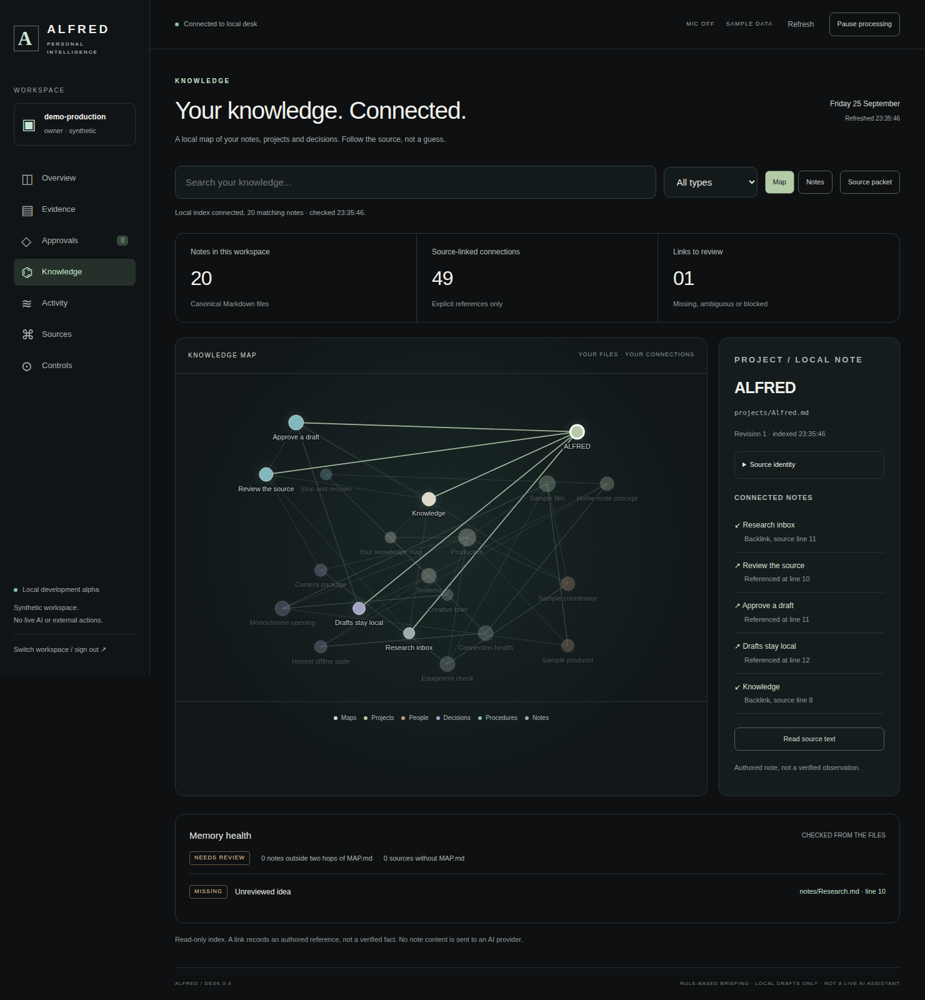

# ALFRED

Personal and operational intelligence, under your authority.

## Current release: Knowledge Desk v0.4, local development alpha

This branch contains a working browser workspace over a persistent local service,
plus a read-only Markdown knowledge index and explicit reference graph. It is not yet a
live AI assistant. No model, microphone, external account/device, ENDSTATE or Noir is connected.

**Working branch:** `feat/alfred-knowledge-desk-2026-09-26`.
It extends the earlier Desk branch rather than restarting from main. Main remains separate
until the reviewed pull-request stack is actually merged. No hosted deployment is implied.



## See and run it

- [Knowledge workspace screenshot](docs/evidence/knowledge-v04/ALFRED-knowledge.png)
- [Briefing screenshot](docs/evidence/knowledge-v04/ALFRED-overview.png)
- [Mobile knowledge view](docs/evidence/knowledge-v04/ALFRED-knowledge-mobile.png)
- [Source inspection](docs/evidence/knowledge-v04/ALFRED-note.png)
- [Read-only offline HTML preview](docs/previews/ALFRED-Desk-v04.html): actual frontend with fictional in-file data, not the backend.
- [Local run guide and explicit limitations](docs/KNOWLEDGE.md).

```sh
python3 -m alfred.desk init --data-dir ~/.local/share/alfred/desk-v04-demo
python3 -m alfred.desk access --data-dir ~/.local/share/alfred/desk-v04-demo
python3 -m alfred.desk serve --data-dir ~/.local/share/alfred/desk-v04-demo
```

Open `http://127.0.0.1:8765` on that machine. The access command reveals a private local
sign-in key in your terminal; do not share or commit it. Use a new data directory outside
the repository. Python/POSIX development target; no runtime dependencies or model keys.

## What works

The existing Desk supplies sign-in, source-linked briefings, acknowledgements, exact draft
approvals, an action history, source health and pause/resume. Events, approvals and local
drafts survive restart. The foreground supervisor scans configured sources and processes
previously approved work automatically while the explicitly launched process is alive.

Knowledge adds searchable Markdown notes, declared types/tags/aliases, a graph and list,
backlinks, exact source text/hash/revision inspection, broken/ambiguous link diagnostics,
MAP.md coverage checks and bounded source packets. The connector never writes notes,
executes their instructions, loads Obsidian plugins or sends their contents to a model.

A graph edge is an explicit file reference, not a verified fact about the world. A source
packet contains excerpts, not a generated answer. The demonstration uses 20 fictional
notes and three sample production reports. No private user vault was accessed.

The only action effect is a local SQLite draft with content read-back. **Nothing is sent.**

## Research and build programme

[Roadmap](docs/ROADMAP.md) · [MAPS / Obsidian assessment](research/MAPS_AND_OBSIDIAN.md) ·
[Product brief](docs/PRODUCT_BRIEF.md) · [Architecture](docs/ARCHITECTURE.md) ·
[Agent landscape](research/LANDSCAPE.md) · [Jev / Alibaba research](research/JEV_AND_ALIBABA.md) ·
[Continuation record](SESSION_HANDOFF.md)

The 2,073 retained upstream files across eight pinned projects remain research data, not
installed runtimes. Preserve licences, notices and the documented copy scope. Root licences
do not clear every dependency, model, voice, logo or dataset. No blanket licence for
ALFRED-original code has been selected by this work.

## Verification

```sh
python3 -m unittest discover -s tests -v
python3 tools/import_sources.py --verify
python3 tools/extend_sources.py --verify
```

[Knowledge acceptance workflow](.github/workflows/knowledge-v04.yml) exercises the real
browser/server/database/files plus the earlier Desk flow. [Evidence](docs/evidence/knowledge-v04/)
contains the actual test output, browser reports, source hashes and screenshots. A workflow
file alone does not prove success: inspect its actual run and final source receipt.

## Honest limits

Local alpha, not a hardened hosted service. No full device pairing/key rotation, database
encryption, secure-erasure/backup policy, full Obsidian parser, semantic world model,
live reasoning, ambient voice, external connector, cloud scheduler or operational safety
validation. SQLite indexes and metadata have bounded development limits. The stdlib HTTP
service must not be exposed publicly. Use synthetic data while these gaps remain.

All personal, company and operational permissions remain explicit architectural boundaries.
No autonomous use-of-force authority or unrestricted security control is implemented.
Private recordings, credentials, contacts and client data do not belong in this public repo.
