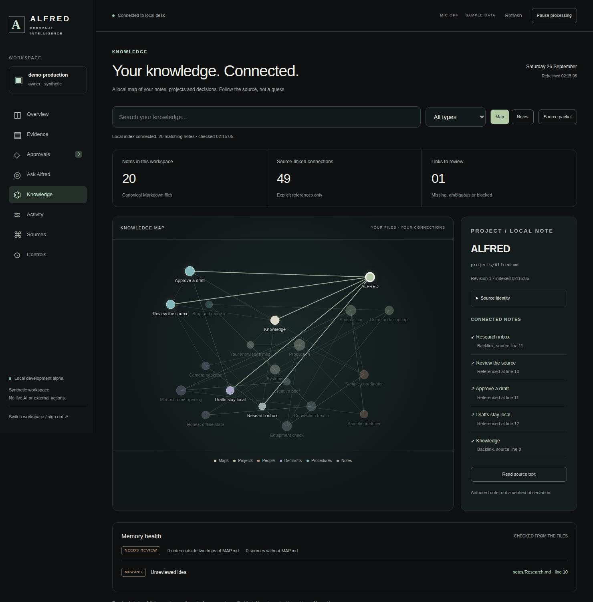

# ALFRED

Personal and operational intelligence, under your authority.

## Grounded Desk v0.5: local development alpha

A working browser Desk over a persistent local service, read-only Markdown knowledge
index, explicit note-reference graph and source-first question interface. No model is
enabled by default. An optional tool-free local-model adapter is implemented; actual
model inference and answer quality have not been validated in this release.

**Current working branch:** `feat/alfred-grounded-desk-2026-09-26`.
This extends the existing Knowledge Desk. Main remains separate until the reviewed PR
stack is merged. No hosted deployment or installation on the user's devices is implied.



## See it

[Ask Alfred screenshot](docs/evidence/grounded-v05/ALFRED-ask-desktop.png) ·
[Mobile question view](docs/evidence/grounded-v05/ALFRED-ask-mobile.png) ·
[Briefing](docs/evidence/grounded-v05/ALFRED-overview.png) ·
[Source inspection](docs/evidence/grounded-v05/ALFRED-ask-source.png)

[Open/download the standalone HTML preview](docs/previews/grounded-v05/ALFRED-Desk-v05.html).
This packages the actual frontend with fictional in-file data. It is read-only and
supports three precomputed question examples. It is not the live backend, a connected
model or a hosted assistant. Full question retrieval requires the local application.

## Run the actual local application

```sh
python3 -m alfred.desk init --data-dir ~/.local/share/alfred/desk-v05-demo
python3 -m alfred.desk access --data-dir ~/.local/share/alfred/desk-v05-demo
python3 -m alfred.desk serve --data-dir ~/.local/share/alfred/desk-v05-demo
```

Open `http://127.0.0.1:8765` on that machine. The access command reveals your private
local key in your terminal: do not share or commit it. Use a fresh data directory outside
the repository. Python/POSIX development target; no runtime dependencies or cloud keys
are needed for source mode. The CLI has an explicit `--local-model` option for a separately
installed local Ollama server; see [the boundaries and instructions](docs/GROUNDED_DESK.md).

## What works

The existing Desk retains sign-in, briefings, acknowledgements, exact local-draft
approvals, result history, source health and pause/resume. SQLite state survives restart.
The launched local supervisor scans configured sources and processes already approved
local drafts while the process remains alive. It is not a cloud automation service.

Knowledge reads an explicitly selected Markdown folder, indexes declared note metadata,
resolves explicit links and supports a graph, list, backlinks and exact source inspection.
MAP.md checks flag broken links and map coverage. No Obsidian plugins or private vaults
have been loaded in this delivery. Files remain canonical and are not modified.

Ask Alfred adds short natural-language questions, bounded keyword and one-hop link
retrieval, up to five source excerpts with exact lines/revisions/hashes, source-change
invalidation and portable Markdown evidence export. Source mode is visibly not an
AI-generated answer. Optional generated interpretations must cite valid source ranges;
that checks reference integrity, not factual entailment. No tools are offered to the model.

The graph currently means note A explicitly links to note B. A typed entity-and-claim
graph is a separate planned layer, not a capability inferred from attractive visual dots.

**The only implemented action effect is a local SQLite draft. Nothing is sent.**
No microphone, external account/device control or ENDSTATE/Noir integration is active.

## Research and programme

[Current memory/graph architecture](docs/MEMORY_ARCHITECTURE.md) ·
[Source-first question guide](docs/GROUNDED_DESK.md) ·
[Roadmap](docs/ROADMAP.md) · [Original MAPS assessment](research/MAPS_AND_OBSIDIAN.md) ·
[Agent landscape](research/LANDSCAPE.md) · [Jev and Alibaba](research/JEV_AND_ALIBABA.md) ·
[Continuation record](SESSION_HANDOFF.md)

All 2,073 retained files across eight pinned upstream projects remain research data,
not installed agent runtimes. Keep their licences/notices and exact source scope. The
MAPS guide was assessed, not copied wholesale under an unverified licence. No blanket
licence for ALFRED-original code has been selected by this work.

## Verification

```sh
python3 -m unittest discover -s tests -v
python3 tools/import_sources.py --verify
python3 tools/extend_sources.py --verify
```

[Acceptance workflow](.github/workflows/grounded-v05.yml) runs first-party tests, source
archive verification, the previous Desk and Knowledge browser regressions, new question
acceptance and standalone preview checks. [Evidence and exact source receipts](docs/evidence/grounded-v05/)
record the actual run. A workflow file alone is not a passing result.

## Limits

Synthetic-data local alpha, not a hardened service. No application-level database
encryption, mature key rotation, production tenancy/retention, full Obsidian parser,
semantic world model, tested real-model quality, voice, external accounts, cloud scheduler
or operational safety validation. The stdlib HTTP server must not be exposed publicly.
No private notes, recordings, credentials or client data belong in this public repository.
