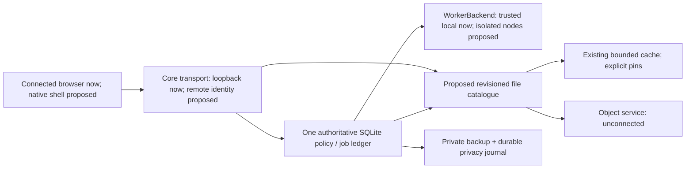

# Pilot platform recommendations — 3 October 2026

Stage: `PILOT-GROUNDWORK`. Requirements RUN-001/002/003, SYS-001/002/003,
UX-001/002 and the existing operational workstreams. This is a decision package,
not a second roadmap. [NEXT_STAGE](../docs/NEXT_STAGE.md) remains the active gate.

Recommend keeping the Python/SQLite Core and the connected React/Three/GLSL
console; evaluating Tauri as a client wrapper; keeping one durable job authority;
and prototyping file reads separately from execution. Do not choose a provider or
move private data from these results. Key custody and authority location are still
owner decisions. Desktop packaging does not establish always-on availability.

The [source receipt](pilot-primary-sources-2026-10-03.json) records current official
repository revisions, URLs, fetched-byte hashes and access limitations. Candidate
source was read as data, not installed, executed, imported or treated as agent
instructions. Published security/performance claims remain vendor claims.
Direct Tauri, Cloudflare and Hetzner websites returned egress HTTP 403; official
Tauri/Cloudflare source repositories supplied the docs. Later reads succeeded
for boxd lifecycle/pricing, E2B pricing, pCloud features/terms/pricing and Nebius
pricing. Specific current rates and their units are recorded below. Space sites
and several hosting/colocation sites remain unavailable; homepage access alone
does not establish service terms. Research domain additions are saved in the
environment draft; saving did not change the running network policy. Historical
claims and unverified service properties remain labelled.

## Native client: evaluate a wrapper, preserve the application

| Choice | Evidence and fit | Cost/risk of the choice | Recommendation |
|---|---|---|---|
| Tauri 2 + Python sidecar | Official README supports arbitrary HTML/JS/CSS and OS WebViews; official sidecar docs explicitly describe Python/PyInstaller and architecture-specific binaries. Root README advertises MIT or Apache-2.0; MIT file fetched. | WebView2/WKWebView/WebKitGTK have different WebGL, media, accessibility and driver behaviour. Rust, binary bundling and per-platform lifecycle/signing become new build surfaces. | First packaging candidate, subject to target-device rendering and lifecycle acceptance. No Tauri dependency was added. |
| Electron + Python child service | Official process-model/security docs describe a browser main process and isolated renderers; root licence is MIT. Chromium is closest to the current browser test target. | Bundled browser/runtime increases update and distribution responsibility. Disable renderer Node integration, enable context isolation/sandbox, constrain navigation/CSP and validate every IPC sender. | Keep as a fallback if the actual console fails OS WebView acceptance. No Electron dependency was added. |
| Browser/PWA connected client | Existing same-origin browser-to-backend acceptance exercises the approved console. | No native service management, OS custody integration, installer or proven offline client. Laptop sleep still stops a laptop Core. | Retain for compatibility and as an enrolled-client option in a later remote stage. |

Suggested first packaging experiment: serve the existing built console from the
existing Python sidecar on a chosen loopback port, retain sign-in and exact
Host/Origin/CSRF checks, and load that origin in one WebView. Do not grant the
renderer a general shell, arbitrary filesystem access or Core credentials through
URLs/localStorage. The parent owns the sidecar process group and lifetime; the
client reports stopped/unreachable truthfully. A remote-Core client would use a
separate transport and enrolment contract, not quietly open this loopback server.

Tauri capability docs say overlapping capabilities combine permissions and do not
protect against malicious Rust, weak scopes, compromised development systems or
WebView vulnerabilities. Enable a named minimal capability set explicitly; do not
auto-enable every capability file or enable remote IPC for arbitrary content.
Updater docs require signed updates; signing key custody/revocation is a separate
operational decision. macOS signing docs describe Apple credentials, a Mac and
notarisation; no account was created or signing credential requested here.

No Rust compiler or WebKitGTK 4.1 development package was present in this builder.
Chromium/software rendering is available and tested; it cannot certify a Tauri
build or physical Mac/Windows rendering. After a dependency/target decision, the
next executable packaging step is an isolated branch with one existing console
window and the packaged Python sidecar, then measure cold start/RSS/package size,
GPU rendering, reduced motion, keyboard/screen-reader navigation, background and
sleep/resume, port contention, service crash, sign-out, upgrade and rollback on
the chosen real OS. Record the target, release signatures and results before
calling it an installed native application.

## Core location and trusted nodes

| Authority location | What stops when the laptop sleeps | Data/key implication | Practical choice |
|---|---|---|---|
| Primary laptop | Core, indexing, queues, local workers and browser connectivity | Smallest new trust surface, interactive unlock possible | Continue synthetic development here. It cannot meet always-on continuity. |
| Always-on home host | Laptop client/local worker stop; home Core and available home workers can continue | Home power/network, patching, physical access and unattended key custody become dependencies | Preferred first continuity experiment if a suitable owner-approved host exists. Availability and hardware suitability are unmeasured. |
| VPS Core | Laptop-local capabilities stop; provider-hosted Core/approved workers can continue | Core can decrypt allowed scopes; provider admin/memory/snapshot access and approved egress matter | Consider only after explicit region, budget, remote-auth and server-readable-data decisions. Do not infer confidentiality from a VPN or disk encryption. |

Exactly one writable SQLite authority per workspace/job. Replicate backups or
read-only projections, never a live database/WAL through a drive. An independent
Core replica needs fencing/leader election and disaster-recovery acceptance; it
is not implemented. Clients and workers may reconnect to the one authority; they
must not manufacture retries or execution rights from a cached job record.

Proposed remote contract, reusing `JobCoordinator` and `WorkerBackend`:

1. Explicitly enrol a device/worker with an OS-held private identity and bounded
   source/purpose/kind grants. No shared owner's bearer embedded in worker images.
2. An authenticated transport supplies device identity to policy; the existing
   loopback endpoints stay loopback. TLS identity, audience, replay protection,
   Origin rules, session revocation and transport resource limits need acceptance.
3. Core issues a job/attempt/worker-bound expiring lease, exact input revisions,
   limits, cancellation state and allowed result types. Workers receive allowed
   bytes, not a vault credential or unrestricted shared drive.
4. Heartbeat checks the current lease and policy. Cancellation is durable and
   cooperative, then a hard stop where the backend supports it. Connectivity loss
   is an observation, not proof of stopped execution.
5. Only the current attempt may publish a hash-checked result. A verified byte
   hash proves integrity, not factual correctness. Source revocation/deletion
   withdraws access to dependent results.
6. On reconnect, reconcile job IDs, attempts, leases, source revisions and effect
   receipts. Retry only work declared side-effect-free. Possible external effects
   become unknown for review; snapshot rollback cannot undo them.

The new [node contract tests](../tests/test_pilot_node_contract.py) exercise actual
concurrent transactions on one SQLite authority with two logical worker IDs:
one lease, stale attempt rejection, cancel/expiry reconciliation and refusal of
an original lease under a different/revoked worker ID. The [SIGKILL recovery
tests](../tests/test_pilot_recovery.py) kill a real child process and distinguish
safe retry from unknown effects. These do not implement worker-specific remote
credentials, prove a second machine, or demonstrate the laptop-off acceptance
scenario. The current local worker still uses the existing owner operator;
remote enrolment is a concrete remaining identity task.

Transport candidates: Tailscale's fetched client root is BSD-3-Clause; the hosted
control plane is a separate service. Headscale's fetched root is BSD-3-Clause,
with self-hosted control-plane operations borne by us. NetBird's current root
explicitly exempts `management/`, `signal/`, `relay/` and `combined/`: those are
AGPLv3, while other parts are BSD-3-Clause. This changes a self-hosted adoption
review and is not cleared by a process boundary. WireGuard remains a transport
option from the prior shortlist; its specific adoption source/terms have not
been refreshed. All require routing, enrolment/revocation and relay-egress
acceptance; none grants ALFRED source permissions or solves Core custody.

The proposed component boundaries are independent of provider selection:



| Threat / failure | Contract and current evidence | Remaining boundary |
|---|---|---|
| Another credential reads restricted approvals | Credential-private receipts plus source reads; A1 negative/positive HTTP regressions | Shared team history needs its own policy and acceptance. |
| Renderer becomes compromised | Preserve same-origin sign-in/CSRF and minimal proposed native IPC; no unrestricted shell/vault tools | Actual native capability/sender/CSP acceptance is unrun. A framework's capability system is not proof of safe Rust/plugin code. |
| Worker reconnects with a stale or copied lease | Existing job/attempt/worker lease rejects another ID and stale attempt; local contention/cancel tests pass | Remote device identity and isolation are not implemented; copied host credentials must be stripped independently. |
| Provider or host administrator reads plaintext | Custody proposal explicitly identifies service-readable keys and snapshot/memory access | No application encryption or provider confidentiality acceptance; private data remains gated. |
| Offline client serves revoked/deleted cached bytes | Synthetic file method checks authority on a cache hit/fetch and purges all local revisions/pins on deletion | Volatile objects/callbacks are not a security boundary; real offline expiry/revocation propagation and a durable permission-filtered catalogue need implementation. |
| Backup or machine snapshot revives obsolete state | Local privacy/export journal replay and stale-lease reconciliation pass | A provider snapshot/fork must preserve the current authority/tombstone boundary while stripping credentials; no remote snapshot acceptance exists. |
| A snapshot rollback repeats an external effect | Unknown effects reconcile instead of blind retry; SIGKILL test distinguishes safe work | No external effect was attempted, undone or proven isolated. |

## Persistent agent computers and isolated workers

Persistent files, installed packages, running memory, snapshots and external
effects have distinct lifecycles. A persistent computer can preserve its disk
while a process crashes; a snapshot may restore disk/memory while external APIs
remain changed. A disposable worker can isolate one job yet lose disk on teardown.
The worker backend must declare these properties and an export/exit path.

| Candidate | Current evidence / known boundary | Later acceptance before adoption |
|---|---|---|
| Existing local subprocess | Real bounded job ledger/limits and byte results. It is neither VM isolation nor a security sandbox. | Retain only trusted synthetic work; no arbitrary imported code or private-data containment claim. |
| Owner-managed VPS/VM worker | Architecturally fits the existing backend contract. No provider, hypervisor or quota is selected. | Prove permitted nested virtualisation/KVM, image identity, network policy, workspace disposal, budgets, cancellation, host-crash recovery and backup/exit portability. A container alone is not a VM. |
| boxd | Current official docs describe persistent machines, memory/disk forks and snapshots, disk-only off-cluster backups, and unlimited runtime. Current pricing offers self-host/BYOC under a custom annual licence; that is not an open-source grant or our runtime acceptance. Prior operator/licence research remains historical. | Preserve as a persistent-computer candidate. Live forks explicitly retain processes and logins, so use clean uncredentialed worker images and fresh ALFRED enrolment. Confirm operator/contract, licence, region, deletion, KVM, costs and independent egress controls. |
| E2B | Current official SDK and separate infrastructure repositories fetched at pinned revisions, both with Apache-2.0 root licences. The infrastructure README describes Firecracker, memory/disk snapshots, live forks, object storage, PostgreSQL and Linux with KVM. These are published capabilities, not our runtime acceptance. Hosted service terms/prices are not established by source licensing. | Disposable/pause/resume budgets, actual KVM availability, snapshot credential sanitisation, persistent-volume semantics, network isolation, cancellation, unexpected billing, result reconciliation and portable data export. Snapshot restore can include memory; do not infer free idle capacity or safe credential forks from that. |
| NVIDIA OpenShell | Current official root is Apache-2.0. README claims kernel confinement, endpoint-bound credential injection, verified policy changes and telemetry controls. These are published claims, not our containment test. | Review actual kernel/runtime/deployment prerequisites, policy model and GPU access; disable optional telemetry for the approved pilot if appropriate. Test forbidden files/network, credential destinations, escape cases, host failure, cancellation and residual volumes. It is not interchangeable with a persistent boxd computer. |

Fork contract: clone only approved durable file revisions and reproducible package
manifests. Strip service keys, OS identity stores, pairing/session material,
network memberships, pending effect intents and all job leases. Issue a new
identity through the Core only if separately authorised. Copying a whole live
machine snapshot with usable credentials violates this contract. Even a clean
fork needs budgets and independent isolation; the local lease test only proves
that a different worker ID cannot reuse another worker's lease.

Current [boxd fork docs](https://docs.boxd.sh/guides/fork.md) state that a running
machine's processes keep their PIDs/start times and that shared-machine forks
restore Claude Code/Codex logins. A new provider hostname/private IP does not
establish a new ALFRED worker identity. A fork with the **same** still-valid
ALFRED credential/lease could retain authority; the different-ID test does not
prove otherwise. Never fork the authoritative Core, its live SQLite/WAL, keys
or privacy journal as an independent authority. The required experiment is a
clean worker image, independently issued identity, single-authority fencing and
negative tests for inherited secrets, leases, network membership and effects.

[Resources](https://docs.boxd.sh/guides/resources.md) specify default 2 vCPU,
8 GiB RAM and a 100 GB copy-on-write disk, auto-suspend off, and automatic
hibernation after four hours without network traffic. Unlimited runtime is not
proof of a continuously scheduled always-on Core. Idle timers, cron work and
reconnect must be tested under an explicitly configured lifecycle. The
[backup guide](https://docs.boxd.sh/guides/disaster-recovery.md) distinguishes
disk-only reflink captures from memory/disk snapshots, with schedules off by
default and seven-day default retention. In-place restore cold-boots an older
disk; current off-host privacy intents and external effect receipts must survive
that rollback separately. No provider restore was performed.

The [egress guide](https://docs.boxd.sh/guides/egress-allowlist.md) describes a
host-enforced allowlist that guest root cannot widen, but an empty list is
**unrestricted** and host-bound secret destinations are always admitted. Those
exceptions must be part of an isolation test; a nominal allowlist is not an
ALFRED permission boundary or proven private-data containment.

## Cloud-backed files: separate the file tier

Keep Core database/secrets local to its authority; durable user files in a
revisioned file tier; indexes rebuildable; backups private and restorable;
worker scratch disposable. Object storage supplies objects, not safe shared
SQLite semantics or multi-client memory.

Space/SpaceFS and the pCloud second-drive experience remain relevant: browse a
catalogue, fetch on demand, pin explicitly for offline availability, and avoid
copying every file to every client. Space returned tunnel HTTP 403 and its docs
HTTP 503, so earlier FUSE/S3 descriptions and licensing remain historical.
Current [pCloud features](https://www.pcloud.com/features/synchronization)
describe offline-selected files and automatic synchronisation on reconnection;
that does not implement ALFRED's permission expiry, conflict or tombstone rules.
Its current [terms](https://www.pcloud.com/terms_and_conditions) identify pCloud
International AG, prohibit account transfer and retain termination/change
provisions. Lifetime consumer pricing is not a perpetual service guarantee or
permission to resell an ALFRED backend. Retention/secure deletion and encrypted
key custody need their own tests and terms. No file-service connection occurred.

Current open-source file options read at pinned revisions: JuiceFS Apache-2.0
README describes an object store **and a separate metadata engine**, including
Redis/MySQL/SQLite/TiKV; it is operationally more than a drive mount. rclone's MIT
root supplies transfer/mount tooling, not ALFRED identity or temporal semantics.
SeaweedFS Apache-2.0 README describes S3/POSIX and filer/volume components; adoption
would add a storage control plane and operational responsibility. Compare these
with a deliberately small object API plus existing `BoundedCache` before adding
a filesystem dependency. No new storage dependency is installed.

Proposed file contract: permission-filtered catalogue, opaque file identity,
immutable revision/digest/size, explicit read/write purposes and scope, bounded
fetch/range limits, compare-and-swap writes, explicit offline pins, freshness
labels, conflicting-copy review, deletion tombstones and lineage. A cached blob
is not authority; every return rechecks current policy. Remote offline operation
requires a deliberate revocation-delay/expiry policy, not indefinite cached
grants. A pin does not guarantee availability when a disk is missing/full.

The opt-in [synthetic file-tier model](../prototypes/pilot_file_tier.py) uses the
existing bounded cache, in-memory synthetic objects (maximum 4096 bytes each)
and an independent authority callback. Its six failure/positive tests cover
on-demand/pinned reads, revocation on a cache hit or during fetch, stale offline
copies, compare-and-swap conflicts, pinned capacity, and tombstones purging all
local revisions/pins. It opens no remote connection and mounts no filesystem.
Its catalogue is not durable, its authority callback is local, and it does not
prove encryption, distributed offline revocation, provider deletion or secure
erasure. Metadata digests/lineage remain, and copied files cannot be recalled.

## Workload economics and the provider shortlist

The executable [cost model](../tools/model_platform_costs.py) and
[dated output](pilot-costs-2026-10-03.json) separate active users, sessions, model calls and
input/output tokens, active/idle CPU/GPU hours, Core reservations, stored GB,
full retained backup copies, replicas, object requests, other-service egress,
monitoring, signing, tax/FX and operating staff. Reproduce it with:

```sh
python3 tools/model_platform_costs.py --output /tmp/alfred-costs.json
python3 -m unittest tests.test_platform_costs -v
```

Cloudflare R2 Standard list rates were refreshed from the official docs
source: USD 0.015/GB-month, 4.50/million Class A and 0.36/million Class B requests,
rounded up to billable units. Direct R2 egress is free; connected services and
source migrations can charge. Infrequent Access has a 30-day storage minimum
and retrieval charges, so it is not modelled as an automatically cheaper hot
drive. Base scenarios exclude the published free tier to expose paid unit
economics; the calculator can apply it explicitly per one account.

Other current published rates are kept in `current_provider_examples` in the
cost JSON, separate from the illustrative whole-stack scenarios. Currency,
GB/GiB, billing state and subscription units are preserved; no live FX, quote,
capacity, region, eligibility or provider purchase is established.

| Current primary rate checked 3 October | Reproducible comparison | Implication |
|---|---|---|
| [boxd](https://boxd.sh/pricing/): EUR 0.049/vCPU-hour running; 0.015/resident GiB-hour running **or standby**; 0.0001/written GiB-hour in every state; excludes VAT | 2 vCPU, 2 GiB resident RAM, 20 GiB written disk: EUR 0.130/hour; 720 running hours EUR 93.60. Disk alone while hibernated for 720 hours EUR 1.44. | "Near zero" idle marketing is not zero RAM/disk billing. Published EUR 30 credit requires a payment method, then default EUR 20 automatic top-ups; none is applied. Actual usage, snapshot/memory-dump accounting and custom terms need confirmation. |
| [E2B](https://e2b.dev/pricing): USD 0.000014/vCPU-second and 0.0000045/GiB RAM-second; Pro USD 150/month plus usage | 2 vCPU/4 GiB costs USD 0.1656/running hour; 720 running hours plus Pro USD 269.23. Optional published concurrency add-ons: 600 at USD 500/month or 1100 at USD 1000/month. | Hobby sessions up to one hour, Pro up to 24 hours, Enterprise multi-day/persistent are published tier claims. This is a sandbox comparison, not a durable Core quote; pause/storage billing needs acceptance. Published one-time USD 100 Hobby credit is not applied. |
| [Nebius](https://www.nebius.com/prices): **effective 1 October 2026** H100 USD 4.50, H200 5.40, B200 8.50/GPU-hour; excludes applicable tax | 720 H100 GPU-hours: USD 3240 before any other instance charges. The calculator's separately labelled current-rate idle sensitivity totals USD 5199.50 for its assumed 100-active workload. | Use the effective-date column rather than adjacent older rates. GPU-hours are not an available instance quote; minimum shape/region remain unverified. Spot rates vary and cannot support a fixed budget here. |
| [pCloud](https://www.pcloud.com/cloud-storage-pricing-plans): displayed one-time lifetime promotions USD 219/500 GB, 499/2 TB, 1499/10 TB | Record the dated offer without converting it into a guaranteed GB-month rate. | Consumer promotions and service lifetime have contractual limits; no reseller, backend integration or recovery guarantee follows. |

All model, VPS, CPU/GPU, staffing and monitoring rates below are **illustrative
assumptions**, not verified provider prices, approved budgets or capacity tests.
They use 15 sessions/user/month, three model calls/session, 3000 input/600 output
tokens/call, two one-minute CPU jobs/session, 2 GB/user plus two full backups,
no active GPU, tax zero and USD reporting. Headcount is one input, not the model.

| Scenario | Assumed vendor cost/month | Explicit staff cost/month | Total/month |
|---|---:|---:|---:|
| 10 active synthetic pilot | $78.02 | $675.00 (15 h) | $753.02 |
| 100 active, two Core instances costed | $159.50 | $1,800.00 (40 h) | $1,959.50 |
| 1000 active, two Core instances costed | $494.66 | $7,200.00 (160 h) | $7,694.66 |

Two instances being costed does not establish active-active safety. At 100 active
users, a 720-hour idle GPU reservation adds $1,080 under the assumed rate, while
quadrupling output tokens adds $32.40. Ten full backups rather than two add $24.
The illustrative $1000 credit scenario reduces the first invoice to staff costs
but returns to $1,959.50 after credits. No credit eligibility is established;
discounts and quotes remain separate inputs. The tax/GBP sensitivity is an
explicit assumption, not live exchange-rate or tax advice. Model retry/context
growth, support incidents, compliance and capacity need measured pilot inputs.

| Role | Preserve these candidates | Recommendation now / information still needed |
|---|---|---|
| Hosting | OVHcloud, Scaleway, DigitalOcean, Hetzner | Shortlist CPU capacity/regions against the chosen authority/custody model. Fresh invoice-like prices, VAT/currency, backup/egress, nested-KVM rights, cancellation and support terms remain unverified; no ranking by old chat prices. |
| Edge/storage | Cloudflare, Backblaze | R2 is a cost/reference candidate, not a chosen drive. Refresh Backblaze object minimums/egress/regions and both providers' retention/deletion/exit behaviour. |
| GPU/ecosystem | NVIDIA, Nscale, Nebius | OpenShell source and Nebius's effective-date list rates are refreshed; Nscale's homepage establishes role only. GPU availability, whole-instance costs, programmes and partner/credit eligibility remain unverified. Choose on-demand/reservation after measured demand. |
| Execution | boxd, E2B, OpenShell; local/VPS workers | Decide persistent versus disposable properties before buying; require the job contract and containment acceptance above. |
| Transport | Tailscale, Headscale, NetBird, WireGuard | Choose after device/custody/remote-auth architecture. A private network is transport, not application policy or tenant isolation. |
| Colocation | Telehouse, Digital Realty | Preserve as later options; no current quote, rack/power/network minimum, relationship or SLA is established. |

Rent elastic compute first where workload is variable; reserve or dedicate only
when measured utilisation/latency and contractual exit costs justify idle
commitments. Colocation/owned hardware must account for amortisation, financing,
power, remote hands, spare capacity, transit, insurance, staffing and physical
failures. Compare a 36-month total-cost range and utilisation break-even against
rent before recommending ownership. Licensing/acquisition requires source/IP,
dependency/model/data rights, security/support obligations and integration/exit
diligence; prior valuation chat is not evidence of financeability or asset value.

Draft questions for a later authorised conversation: exact service/operator and
terms version; permitted KVM/GPU isolation; region/subprocessors/admin access;
idle/snapshot/storage/egress charges; metering and hard spend caps; cancellation
and unknown effects; retention/deletion including snapshots; export formats;
support/SLA and termination/portability; credits eligibility/expiry/post-credit
rates; self-host/licensing rights. No outreach or programme application occurred.

Cloud, Private and Sovereign remain proposed labels. Before commercial claims,
define who holds decrypting keys, which admins can access plaintext, jurisdiction,
tenant separation, audit/support obligations and exit terms, then test them.
Specialist products remain independent interfaces, not bundled deployments.

## Decisions and next executable steps

1. Review the [custody proposal](../docs/KEY_CUSTODY_PILOT.md): local interactive
   unlock versus unattended service-readable keys, and which scopes may leave
   the laptop. Architecture research is ready; crypto adoption/private-data use
   awaits the recorded choice and explicit approval.
2. Select target client OS and Core location for a later synthetic runtime stage.
   Then package the one console/sidecar; implement authenticated worker identity
   on the existing coordinator; test laptop-off/reconnect on real distinct nodes.
   No owner device or VPS is enrolled from this stage.
3. Apply the saved research network additions in environment settings if the
   remaining inaccessible Space, hosting and colocation sources are needed.
   Retry those official pages and record dates/regions/rates. Current accessible
   provider rates are reference comparisons; replace whole-stack assumptions
   only after selecting a workload, custody model and suitable service shape.
4. Promote the file model only after a durable catalogue/transport/expiry choice,
   independent policy implementation and provider/offline/conflict/deletion tests.
   Keep prototypes opt-in and out of the default server path.

None of these steps is an automatic activation of the private, hosted or
commercial stages. Implementation, synthetic acceptance, merge and deployment
are tracked separately in the stage receipt and requirement register.
